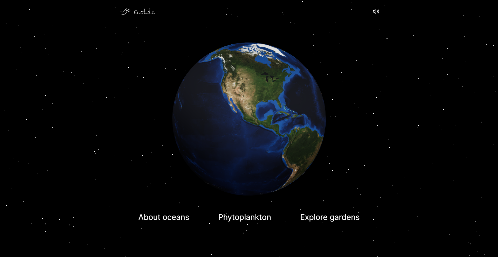

# Ecotide | NASA International Space Apps Challenge 2023

Ecotide is a web platform where users can explore oceanic elements through 3D
models of the world, allowing them to navigate throughout the website, where
they will encounter species and discover intriguing and interesting facts they
may have never imagined. Additionally, they will have a unique experience with
immersive sounds that enhance the user experience.

> Designed and developed in the
> **[2023 NASA International Space Apps Challenge](https://www.spaceappschallenge.org/2023/find-a-team/gazters/?tab=project)**.

- [Ecotide Platform](https://nasa-space-apps.vercel.app/)
- [Figma Design](https://www.figma.com/file/lJEAo2G5GX0BAvf6KCCiyw/Ocean-Garden?type=design&node-id=0%3A1&mode=design&t=cuR1el7ELUlnsuQa-1)
- [What is Ecotide? | Slides](./docs/ecotide-slides.pdf)




## Justification

A significant portion of populations reside in regions without access to the sea
and may lack direct experience with the ocean. Despite their lack of exposure,
these people depend daily on critical processes originating in the ocean. These
processes include producing life-sustaining oxygen through marine
photosynthesis, regulating carbon dioxide (CO2) levels in the atmosphere by
marine phytoplankton, and consuming food resources nourished by marine
ecosystems.

Therefore, developing an accessible platform that effectively communicates the
essential services provided by the ocean to populations residing, whether near
the ocean or not, would raise awareness about all the services and beauty that
the ocean provides us.

By creating a platform that employs visual, auditory, and interactive elements,
we intend to break down complex concepts related to the ocean into easily
understandable knowledge. Through this platform, we aim to empower people with
knowledge and awareness of the ocean's importance, fostering a deeper
understanding of the crucial services it provides to our society.

## Features

When you enter the website, you will be greeted with the landing page, where you
will see a 3D world map and three clickable texts: **"About Oceans"**,
**"Phytoplankton"**, and **"Explore Gardens"**.

- **3D World Map**: It features the rendering of a 3D model of planet Earth and
  a list of the world's oceans. Clicking on an item in the list will direct you
  to the corresponding point on the 3D map where the selected ocean is located.
- **About Oceans**: Clickable text that takes you to a pop-up window displaying
  information about the Pacific Ocean, including climate, plants, animals, its
  impact on the atmosphere, and characteristics.
- **Phytoplankton**: Clickable text that leads you to a pop-up window displaying
  information about different types of phytoplankton, their characteristics,
  species affiliation, and the ocean where they predominantly thrive.
- **Explore Gardens**: Clickable text that directs you to a pop-up window
  explaining the difference between ocean and land gardens, with interactive
  information and examples.

## Technologies

- NASA online resources for 3D assets.
- [Next.js](https://nextjs.org/)
- [TypeScript](https://www.typescriptlang.org/)
- [Model Viewer library](https://modelviewer.dev/) for 3D model rendering.
- [Tailwind CSS](https://tailwindcss.com/)
- [Vercel](https://vercel.com/) for deployment.

## Getting Started

First, run the development server:

```bash
npm run dev
# or
yarn dev
# or
pnpm dev
# or
bun dev
```

Open [http://localhost:3000](http://localhost:3000) with your browser to see the
result.

You can start editing the page by modifying `app/page.tsx`. The page
auto-updates as you edit the file.

This project uses
[`next/font`](https://nextjs.org/docs/basic-features/font-optimization) to
automatically optimize and load Inter, a custom Google Font.

## Learn More

To learn more about Next.js, take a look at the following resources:

- [Next.js Documentation](https://nextjs.org/docs) - learn about Next.js
  features and API.
- [Learn Next.js](https://nextjs.org/learn) - an interactive Next.js tutorial.

You can check out
[the Next.js GitHub repository](https://github.com/vercel/next.js/) - your
feedback and contributions are welcome!

## Deploy on Vercel

The easiest way to deploy your Next.js app is to use the
[Vercel Platform](https://vercel.com/new?utm_medium=default-template&filter=next.js&utm_source=create-next-app&utm_campaign=create-next-app-readme)
from the creators of Next.js.

Check out our
[Next.js deployment documentation](https://nextjs.org/docs/deployment) for more
details.
